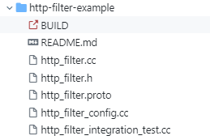

# 插件注册registry设计原理
## 设计目标
envoy具有非常优秀的可扩展性，可以通过插件的形式非常容易的扩展其功能，例如http filter，listener filter等等。这里我们聚焦在通过C++扩展envoy功能的插件，暂时不讨论通过wasm, lua等动态语言扩展envoy的方式。一个插件的开发总的来讲可以分为两部分就是处理配置和处理业务逻辑，其中处理业务逻辑就是实现对应的callback接口，最后将插件注册到系统中。为了方便开发和注册插件，envoy设计一套简单易用的插件注册系统。
## 实现原理
### http-filter-sample插件研究
为了探究envoy的插件注册系统的设计，我们先来研究下[envoy-filter-example](https://github.com/envoyproxy/envoy-filter-example.git)中的http-filter-sample插件看看一个http filter是怎么实现的。http-filter-sample 的功能是根据配置给http添加头部，下面是http-filter-sample的代码:

http_filter.cc和http_filter.h是插件的接口定义和实现，http_filter.proto是这个插件的配置定义，http_filter_config.cc是我们研究的重点，它包含了怎样注册插件的factory以及如果插件的接口如何注册到http框架中。
```C++
namespace Envoy {
namespace Server {
namespace Configuration {

// 所有的http插件的配置工厂类都是NamedHttpFilterConfigFactory的子类, 插件注册系统会将
//此类插件都划分为envoy.filters.http插件
class HttpSampleDecoderFilterConfigFactory : public NamedHttpFilterConfigFactory {
public:
 // 创建插件的工厂函数，这里有插件的配置信息，后续这个工厂函数会将插件注册到http框架中
  Http::FilterFactoryCb createFilterFactoryFromProto(const Protobuf::Message& proto_config,
                                                     const std::string&,
                                                     FactoryContext& context) override {

    return createFilter(Envoy::MessageUtil::downcastAndValidate<const sample::Decoder&>(
                            proto_config, context.messageValidationVisitor()),
                        context);
  }

  /**
   *  Return the Protobuf Message that represents your config incase you have config proto
   */
   //创建一个空的配置对象，后续从配置里面解析的信息都会填充到这个对象中
  ProtobufTypes::MessagePtr createEmptyConfigProto() override {
    return ProtobufTypes::MessagePtr{new sample::Decoder()};
  }

  std::string name() const override { return "sample"; }

private:
  Http::FilterFactoryCb createFilter(const sample::Decoder& proto_config, FactoryContext&) {
    Http::HttpSampleDecoderFilterConfigSharedPtr config =
        std::make_shared<Http::HttpSampleDecoderFilterConfig>(
            Http::HttpSampleDecoderFilterConfig(proto_config));

    return [config](Http::FilterChainFactoryCallbacks& callbacks) -> void {
      auto filter = new Http::HttpSampleDecoderFilter(config);
      callbacks.addStreamDecoderFilter(Http::StreamDecoderFilterSharedPtr{filter});
    }; // 返回插件工厂函数，此工厂函数将插件注册到http filter中，后续有请求访问时就会调用这个插件对应的接口
  }
};

/**
 * Static registration for this sample filter. @see RegisterFactory. 
 */
 // 最后将插件的配置工厂类注册到系统中，新版本可以直接调用REGISTER_FACTORY宏
static Registry::RegisterFactory<HttpSampleDecoderFilterConfigFactory, NamedHttpFilterConfigFactory>
    register_; 

} // namespace Configuration
} // namespace Server
} // namespace Envoy
```
开发一个http插件本质上就是实现对应的配置工厂类然后将这个工厂类注册到系统中，这类具体实现了生成配置对象，注册插件到http框架中的逻辑。每个http的插件的工厂类都要继承NamedHttpFilterConfigFactory。在filter_config.h中定义了各个类型的插件的工厂类的基类。
```C++
class NamedListenerFilterConfigFactory; // 分类:  envoy.filters.listener
class NamedUdpListenerFilterConfigFactory; // 分类: envoy.filters.udp_listener
class NamedNetworkFilterConfigFactory; // 分类: envoy.filters.network
class NamedUpstreamNetworkFilterConfigFactory; // 分类: envoy.filters.upstream_network
class NamedHttpFilterConfigFactory; // 分类: envoy.filters.http
```
最后调用REGISTER_FACTORY宏生成一个RegisterFactory对象这个对象会自动将插件注册到系统中供后续框架模块使用。
### RegisterFactory分析
## 总结