# Context 
## 设计目标
Context专门用来简化处理单个请求的多个协程与**请求域的数据**，**取消信号**，**截止时间**等操作。例如，一个net/http包中一个请求通常产生一个协程来处理，如果用户在后续的针对该API启用多个协程处理后续业务的话，当请求结束的时候所有处理该请求的协程应该都要退出，或者协程之间要传递共享的数据，那么都可以使用Context库的接口来简化操作。
## 外部接口
Context库提供了一下的公共接口来提供给用户程序使用：
* TODO与Background 都是Context库提供的默认上下文，两者都是通过内部的emptyCtx实现的，只是互为别名，在实现上没有区别，一般默认使用Context.Background。一般情况下如果当前函数没有传递上下文的话我们会使用Context.Background作为起始的上下文。
    ``` go
    func Context.TODO() Context.Context
    func Context.Background() Context.Context
    ```
* WithCancel 从Context中衍生要给新的上下文和取消函数(CancelFunc)，如果我们调用取消函数则当前上下文和子上下文都会被取消,相关的Go协程也会同步收到改取消信号。
    ``` go
    func Context.WithCancel(parent Context.Context) (Context.Context, Context.CancelFunc)
    ```
* WithDeadline和WithTimeout从Context衍生出一个新的上下文和取消函数，如果用户调用取消函数或者到截至时间当前上下文和子上下文都会被取消，相关的协程也会收到取消函数，WithTimeout只是对WithDeadline的一层封装。
    ``` go
    func Context.WithDeadline(parent Context.Context, d time.Time) (Context.Context, Context.CancelFunc)
    func Context.WithTimeout(parent Context.Context, timeout time.Duration) (Context.Context, Context.CancelFunc)
    ```
* WithValue 主要是用来上下文用来传递数据的接口。
    ``` go
    func Context.WithValue(parent Context.Context, key, value interface{}) Context.Context
    ```
Context的接口如下：
``` Go
type Context interface {
    // 返回截止时间，这个对WithDeadline和WithTimeout返回的上下文有效
    Deadline()(deadline time.Time, ok bool)
    //接受取消信号的chan
    Done() <-chan struct {}
    // 获取错误信息
    Err() error
    // 获取value的接口，这个一般用于WithValue返回的上下文
    Value(key interface{}) interface{}
}
```
## 实现原理
在Context内部提供了四种上下文的实现：
* emptyCtx
* cancelCtx
* timerCtx
* valueCtx

其中TODO和Background的返回的上下文就是emptyCtx, WithCancel返回的是cancelCtx上下文，Deadline和Timeout返回的就是timerCtx上下文，timerCtx本质上也是基于cancelCtx实现的，WithValue返回的就是valueCtx上下文。

### emptyCtx的实现
emptyCtx的实现非常简单，Context的接口均实现为空。
``` Go
type emptyCtx int 

func (*emptyCtx) Deadline() (deadline time.Time, ok bool) {
    return
}

func (*emptyCtx) Done() <-chan struct{} {
    return nil 
}

func (*emptyCtx) Err() error {
    return nil 
}

func (*emptyCtx) Value(key interface{}) interface{} {
    return nil 
}
```
同时Context库提供了todo和background两个默认的上下文变量，调用Context.TODO()和Context.Background返回的就是这个变量。

### cancelCtx的实现

取消上下文cancelCtx是Context库中使用最多的一个上下文，主要用来完成关联协程的退出，防止协程资源泄漏的。cancelCtx保证父上下文调用cancel接口后，所有的子上下文都能收到取消信号，关联协程监听这个信号就能根据这个取消信号结束自己的任务。


WithCancel接口是创建一个cancelCtx和取消函数返回给用户，内部会调用propagateCancel接口构建父子上下文之间的关系。代码如下：

```go
 func WithCancel(parent Context) (ctx Context, cancel CancelFunc) {
      c := newCancelCtx(parent)
      propagateCancel(parent, &c)
      return &c, func() { c.cancel(true, Canceled) }
 }
```
propagateCancel函数构建父子上下文之间的关联，当父上下文被取消的时候子上下文也会被取消，其流程如下：


propagateCancel的逻辑主要分为三大块，如上图所示:
* 蓝色部分表示如果父上下文没有取消信号的话，例如:TODO, Background。
则不需要等待将子上下文关联到父上下文去，也不需要等待父上下文的取消信号因为根本没有。
* 红色部分是父上下文有取消函数也就是cancelCtx或者timerCtx类型的，那么分两种情况如果父上下文已经调用了取消函数，那么需要理解调用子上下文的取消函数;如果父上下文还没有调用取消函数那么则将子上下文跟父上下文关联起来，如果某个时刻父上下文调用了取消函数，则可以从父上下文获取子上下文的取消函数并调用。***注意***: 这个流程要全程加锁，防止竞争。
* 绿色部分主要是处理父上下文不是cancelCtx的情况，例如:valueCtx，这时候需要有可能开启一个新协程来处理从父上下文的祖先上下文过来的取消信号，接受到这个取消信号后需要调用子上下文的取消接口。然后同时等待子上下文结束。调用子上下文的cancel函数时因为子上下文没有跟父上下文关联，所以remveFromParent应该设置为false

cancelCtx的数据结构如下：
``` Go
 type cancelCtx struct {
     Context                            //父上下文
     mu       sync.Mutex                //保护临界区
     done     chan struct{}             //取消信号的管道
     children map[canceler]struct{}     //记录关联的子上下文
     err      error                     // 错误信息，首次调用后设置为非空
 }
```
cancelCtx.Done接口返回取消信号的Channel，这个取消信号的Channel只有在第一次调用Done接口的时候才创建。
cancelCtx.cancel接口是一个内部接口，也是最重要的方法，这个方法会关闭上下文中的 Channel 并向所有的子上下文同步取消信号, 同时根据需要将从父上下文中删除子上下文：
``` Go
func (c *cancelCtx) cancel(removeFromParent bool, err error) {
    if err == nil {
	    panic("context: internal error: missing cancel error")
    }
    
    c.mu.Lock()
    if c.err != nil {
	    c.mu.Unlock()
	    return // already canceled
    }
    c.err = err
    if c.done == nil {
    	c.done = closedchan
    } else {
    	close(c.done)
    }
    for child := range c.children {
    	// NOTE: acquiring the child's lock while holding parent's lock.
    	child.cancel(false, err)
    }
    c.children = nil
    c.mu.Unlock()
    
    if removeFromParent {
    	removeChild(c.Context, c)
    }
}
```

### timerCtx的实现
Context.WithDeadline返回的就是timerCtx类型，Context.WithTimeout是Context.WithDeadline封装的。timerCtx是基于cancelCtx实现的，主要加了一个超时的功能，也就是内部有一个定时器，如果定时器超时了就调用上下问的取消函数发送取消信号。WithDeadline的流程如下：


### valueCtx的实现

valueCtx的实现比较简单，就是将用户设置的k-v存储在当先上下文中，调用Value接口查找值的时候如果当前上下文没有找到则调用父上下文的Value接口继续查找。
``` Go
func (c *valueCtx) Value(key interface{}) interface{} {
	if c.key == key {
		return c.val
	}
	return c.Context.Value(key)
}
```

##小结
总的来讲Context的主要作用还是在多个 goroutine 组成的树中同步取消信号以减少对资源的消耗和占用。传值功能可以用来传递API请求中用户信息或者分布式跟踪的信息，不建议用来在多个goroutine间传递请求的所有信息。