# 同步(sync)
## mutex
## rwmutex
## waitgroup
## once
## map
## pool
### 设计目标
sync.pool 包主要是为了将可重用的对象缓存起来，降低频繁分配内存导致的频繁GC带来的在高性能场景下带来的程序性能的下降。
### 外部接口
sync.pool 没有对外提供初始化接口而是直接对外暴漏了Pool的结构由用户手动初始化, 对外暴漏的只有Put和Get接口:
```go
// 从缓存中获取对象
func (p *Pool) Get() interface{}
//将对象放入缓存
func (p *Pool) Put(x interface{})
```

sync.Pool的数据结构跟使用这有关的数据结构如下:
```go
type Pool struct {
    ...
    New func() interface{}
}

```
Get会在缓存为空的时候调用New接口创建一个新对象返回给用户。所以在初始化sync.Pool的时候一定要传一个New对象的接口。

### 实现原理
sync.pool就是一个缓存系统，一个这样的缓存系统的话我们应该考虑以下几个问题：
* 缓存的容量
* 缓存的期限
* 缓存的性能开销

sync.pool的缓存是容量是没有上限的，也就是说容量的上限只跟系统的可用内存有关系，为什么这样设计呢？这是因为sync.pool假定可复用对象会被马上复用，而且sync.pool中缓存的对象的生命周期最多也就两个gc周期的时间，最后会被gc全被回收的，这个时间周期也是比较短暂的。因此也可以看出sync.pool 是不适合用来实现类似http连接池这种缓存的，其生命周期太短对连接池这种系统来讲是没有什么效果的。另外sync.pool在清理缓存数据的时候是完全不会通知使用者的。

为了仅可能的降低性能开销，sync.pool按照每个cpu来划分缓存，先获取本地的缓存，如果没有再在本地缓存链表里面找，如果还没有从其他CPU的缓存中偷一个，如果其他CPU也没有缓存则调用注册的New接口分配一个新对象。下面我们会一一介绍sync.pool是如何实现的。
#### get 接口实现
get接口的源码如下:
```go
func (p *Pool) Get() interface{} {
    ...

    l, pid := p.pin() //获取当前的P的poolLocal和P的索引，这个函数里面开启禁止抢占。
    x := l.private    //首先从private指针里面取。
    l.private = nil
    if x == nil {   //如果private没有缓存，那就从poolLocal的队列里面取。
        x, _ = l.shared.popHead()
        if x == nil { //如果本地的缓存里面也没有，那就其他P的缓存队列里面偷了。
            x = p.getSlow(pid)
        }
    }
    runtime_procUnpin() //这里可以开启抢占了

    ...

    if x == nil && p.New != nil { //如果所有的缓存都为空，那么就调用注册New接口新建一个对象。
        x = p.New()
    }
    return x
}
```
上面的代码去掉了竞态检测的逻辑这个逻辑跟pool操作没有什么关系。
从Get接口我们可以看出pool有三级缓存，每个pool会按照cpu个数建立缓存，get优先从当前所在的P的缓存队列中取数据，找不到在到其他P的队列中去取，最后再调用New接口分配新对象，及保证了性能又尽可能降低分配新对象的频率。整体的流程如下：


这里说一下为什么要禁用抢占，如果不禁用抢占的话，那么如果协程被抢占那么之前获取的P的ID可能不是当前协程运行的所在的P，那么就有可能导致性能问题。
每个P的缓存都由一个poolLocal表示，poolLocal的数据结构如下:
```go
type poolLocalInternal struct {
     private interface{}
     shared  poolChain
}

type poolLocal struct {
    poolLocalInternal 
    pad [128 - unsafe.Sizeof(poolLocalInternal{})%128]byte
}
```
为了降低cache missing poolLocal按照128字节填充，这样保证每个P的poolLocal都能放到不同的cacheline上。
下图展示了多个P的poolLocal的结构:

poolChain的具体实现在下面分析poolqueue一节会详细分析。

getSlow是从其他P的缓存队列中偷取一个，或者从上次gc放入victim中还没有被回收的对象中取一个缓存对象。
```go
func (p *Pool) getSlow(pid int) interface{} {
    size := atomic.LoadUintptr(&p.localSize)
    locals := p.local
    //从其他的P偷取一个
    for i := 0; i < int(size); i++ {
        l := indexLocal(locals, (pid+i+1)%int(size))
        if x, _ := l.shared.popTail(); x != nil {
            return x
        }
    }

    // 下面就是从victim中找一个缓存，victime是下次gc就要被淘汰的缓存对象
    // 获取的逻辑也是限从private里面取，没有再从当前P对应的poolLocal取，
    //最后再从其他P的poolLocal取

    //Try the victim cache. We do this after attempting to steal
    // from all primary caches because we want objects in the
    // victim cache to age out if at all possible
    
    size = atomic.LoadUintptr(&p.victimSize)
    if uintptr(pid) >= size { //没有对应的P
        return nil 
    }
    locals = p.victim
    l := indexLocal(locals, pid) 
    if x := l.private; x != nil {
         l.private = nil
         return x 
    }

    for i := 0; i < int(size); i++ {
        l := indexLocal(locals, (pid+i)%int(size))
        if x, _ := l.shared.popTail(); x != nil {
            return x
        }
    }

    //将victimeSize设置为0，走到这里说明victim缓存里面也没有对象了
    // Mark the victim cache as empty for future gets don't bother
    // with it.
    atomic.StoreUintptr(&p.victimSize, 0)
    return nil
}
```

这里我们需要理解一下什么是victim缓存? 设计这个缓存的目的又是什么？victim cache是cpu硬件处理缓存的一种技术。
>受害者缓存
所谓受害者缓存（Victim Cache），是一个与直接匹配或低相联缓存并用的、容量很小的全相联缓存。当一个数据块被逐出缓存时，并不直接丢弃，而是暂先进入受害者缓存。如果受害者缓存已满，就替换掉其中一项。当进行缓存标签匹配时，在与索引指向标签匹配的同时，并行查看受害者缓存，如果在受害者缓存发现匹配，就将其此数据块与缓存中的不匹配数据块做交换，同时返回给处理器。
受害者缓存的意图是弥补因为低相联度造成的频繁替换所损失的时间局部性。

sync.pool在之前的实现中并没有victim cache，这样会有两个问题：
* 浪费：缓存对象被释放以后又要重新分配
* gc 尖峰：突然释放大量缓存对象会导致gc耗时增加

加入victim cache后，如果sync.Pool的获取释放速度稳定，那么就不会又新的池对象调用New接口进行分配。如果获取的速度下降了，那么对象可能会在两个GC周期内被释放，而不是以前的一个GC周期。同时，victim cache的设计也间接的提升GC的性能，因为稳定的sync.Pool使用导致池化的对象都是long-live的对象，而GC的主要对象是short-live的对象，所以会减少GC的执行。具体的信息可以参考[这篇文章](https://colobu.com/2019/10/08/how-is-sync-Pool-improved-in-Go-1-13/)。

#### put 接口实现

put接口的源码如下：

```go
func (p *Pool) Put(x interface{}) {
    if x == nil {
        return
    }

    ...

    l, _ := p.pin()
    if l.private == nil {  //第一个被释放的，直接放到private
        l.private = x
        x = nil
    }
    if x != nil { //后续的对象直接放入对应P的本地缓存队列里面
        l.shared.pushHead(x)
    }
    runtime_procUnpin() 
    ...
}
```
Put的实现比较简单，就是把要缓存的对象放到pool里面，如果是第一个的话直接放到private，后续的就放到队列里面缓存起来。
#### pin及pinSlow实现
在put和get接口中都有调用pin这个内部接口，上面我们只知道它返回了当前P的poolLocal的信息，和当前P的id并且还禁用了抢占，现在具体看一下pin接口的实现：

```go
func (p *Pool) pin() (*poolLocal, int) {
    pid := runtime_procPin() //获取当前运行所在P的id，并禁用抢占
    s := atomic.LoadUintptr(&p.localSize)
    l := p.local
    if uintptr(pid) < s { // 如果当前P有对应的poolLocal，获取poolLocal
        return indexLocal(l, pid), pid
    }
    return p.pinSlow() //如果当前P没有poolLocal，这是需要初始化新的poolLocal了
}
```
indexLocal是根据pid做索引从share数组中返回对应P的poolLocal。

pinSlow主要工作是初始化poolLocal或者重新分配poolLocal后返回当前P的poolLocal,  如果是初始化的话需要将pool记录到全局的结构中，供后面回收的时候遍历。先看下pinSlow的代码：
```go
func (p *Pool) pinSlow()(*poolLocal, int) {
    runtime_procUnpin() //先打开抢占
    //因为可能要修改allPools数据所以先加全局锁 
    allPoolsMu.Lock()
    defer allPoolsMu.Unlock
    s := p.localSize
    l := p.local
    if uintptr(pid) < s {
        return indexLocal(l, pid), pid //可以找到P的poolLocal
    }
    if p.local == nil { // 记录下当前的pool
        allPools = append(allPools, p)
    }
    
    // 因为用户可能修改了MAXPROCS的值所以这里需要重新计算, 这里分配了每个P的poolLocal会导致
    //之前缓存的对象全部丢失不能被复用了，所以可见修改MAXPROC是一个代价比较大的操作
    size := runtime.GOMAXPROCS(0)
    local := make([]poolLocal, size)
    atomic.StorePointer(&p.local, unsafe.Pointer(&local[0]))
    atomic.StoreUintptr(&p.localSize, uintptr(size))
    return &local[pid], pid
}
```

#### poolCleanup实现
poolCleanup是每次gc执行的时候被调用，初始化时注册到runtime中。其代码比较简单，主要是释放缓存的对象，因为引入了victim cache所以每次是将primary cache放到victim cache中，然后victim中缓存的对象才会被真正淘汰， 所以一个缓存对象的淘汰周期是两个gc周期。
```go
func poolCleanup() {
    //先淘汰老的池里面的数据
    for _, p := range oldPools {
        p.victim = nil
        p.victimSize = 0 
    } 

    //将本地的缓存放入victim cache中
    for _, p := range allPools {
        p.victim = p.local
        p.victimSize = p.localSize
        p.local = nil
        p.localSize= 0
    }

    //将当前的池中的缓存，都放入oldpool中供下次释放
    oldPools, allPools = allPools, nil
}
```

#### poolqueue实现
poolqueue.go 主要是提供一个无锁的队列提供给sync.pool用来缓存的，sync.pool使用的是poolChain，poolChain只是一个链表的指针，真正的无锁队列是由poolDqueue实现的，至于为什么不直接使用poolDqueue而是还要提供一个poolChain的链表结构呢，主要是因为poolDqueeu内部实现是一个固定大小的数组，如果只使用poolDqueue的话，poolDqueue分配多大是不好确定的，但是使用链表的结构就没有这个问题，因为可以随时再挂一个poolDqueue到链表中。poolChain的数据结构如下图:


**poolChain跟Dqueue的模型都是单生产者做消费者的模型**，为了确保在使用过程中确保单生产者的模型, sync.pool在放入数据的时候是关闭了抢占的而且写数据是写在当前P的poolLocal中的这保证就算是同一个P也不会有多个协程同时往队列里面写数据。往队列里面push数据的接口是pushHead，从获取数据的接口为popHead和popTail。
生产者调用pushHead写数据popHead读数据，消费者调用popTail读数据。

pushHead的流程如下：
```go
func (c *poolChain) pushHead(val interface{}) {
    d := c.head
   //分配第一个Dqueue，这里因为已经关了P的抢占所以没有竞争 
    if d == nil { 
        // Initialize the chain.
        const initSize = 8 // Must be a power of 2
        d = new(poolChainElt)
        d.vals = make([]eface, initSize)
        c.head = d
        storePoolChainElt(&c.tail, d)
    }

    if d.pushHead(val) {
        return
    }

    //走到这里说明当前的Dqueue已经满了，需要分配一个新的
    //新的Dqueue的大小为前一个Dqueue的两倍大小

    // The current dequeue is full. Allocate a new one of twice
    // the size.
    newSize := len(d.vals) * 2
    if newSize >= dequeueLimit {
        // Can't make it any bigger.
        newSize = dequeueLimit
    }

    d2 := &poolChainElt{prev: d}
    d2.vals = make([]eface, newSize)
    c.head = d2
    storePoolChainElt(&d.next, d2)
    d2.pushHead(val)
}
```
popHead的流程比较简单，就是从头部开始一个个遍历Dqueue,这里因为不用移动head指针所以逻辑不复杂。
```go
func (c *poolChain) popHead() (interface{}, bool) {
    d := c.head
    for d != nil {
        if val, ok := d.popHead(); ok {
            return val, ok
        }
        // There may still be unconsumed elements in the
        // previous dequeue, so try backing up.
        d = loadPoolChainElt(&d.prev)
    }
    return nil, false
}
```
popTail的流程如下：
```go
func (c *poolChain) popTail() (interface{}, bool) {
    d := loadPoolChainElt(&c.tail)
    if d == nil {
        return nil, false
    }

    for {
        // It's important that we load the next pointer
        // *before* popping the tail. In general, d may be
        // transiently empty, but if next is non-nil before
        // the pop and the pop fails, then d is permanently
        // empty, which is the only condition under which it's
        // safe to drop d from the chain.
        d2 := loadPoolChainElt(&d.next)

        if val, ok := d.popTail(); ok {
            return val, ok
        }

        if d2 == nil {
            // This is the only dequeue. It's empty right
            // now, but could be pushed to in the future.
            return nil, false
        }

        // The tail of the chain has been drained, so move on
        // to the next dequeue. Try to drop it from the chain
        // so the next pop doesn't have to look at the empty
        // dequeue again.
        if atomic.CompareAndSwapPointer((*unsafe.Pointer)(unsafe.Pointer(&c.tail)), unsafe.Pointer(d), unsafe.Pointer(d2
            // We won the race. Clear the prev pointer so
            // the garbage collector can collect the empty
            // dequeue and so popHead doesn't back up
            // further than necessary.
            storePoolChainElt(&d2.prev, nil)
        }
        d = d2
    }
}
```
这里需要注意的是d.next必须先获取，如果不先保存d.next的话，会导致缓存的资源tail指针指的不对，比如如果d2:= loadPoolChainElt(&d.next)放在d.popTail这一行后面，假设执行完popTail是个空在获取d.next之前其他协程往队列里面写了很多数据，这时候当前协程继续执行下面的语句导致tail被调整，因为tail指针被调整，后面的协程也利用不到d的数据，但是此时其实d里面是有数据的。

poolqueue中具体存储数据的是Dqueue结构，Dqueue的队列大小是固定的，存储数据的是一个ring结构的数组使用headTail标记，headTail的高32位表示head的索引，低32位表示tail的索引，这样使用一个64位的整数表示head和tail的好处是我们可以使用CAS对这两个值进行整体操作。数据是存储在vals数组中的：
```go
type poolDequeue {
    headTail uint64
    vals []eface
}
type eface struct {
    typ, val unsafe.Pointer
}
```
Dequeue提供了pack和unpack接口将tail，head打包到64位整数和从整数中获取tail和head。其他的pushHead，popHead和popTail的实现都比较简单易懂这里就不详细解释代码了。

### 小结
sync.pool的实现还是很注意性能的，比如victim cache 无锁队列的使用，虽然代码量很少但是还是很值得学习对编写高性能的golang程序也是很有帮助的。

总结一下sync.pool的功能针对long live的对象提供了一种缓存的功能，供后续的程序继续复用，降低gc的消耗，因为gc针对的主要是short live得对象。
## cond
## atomic